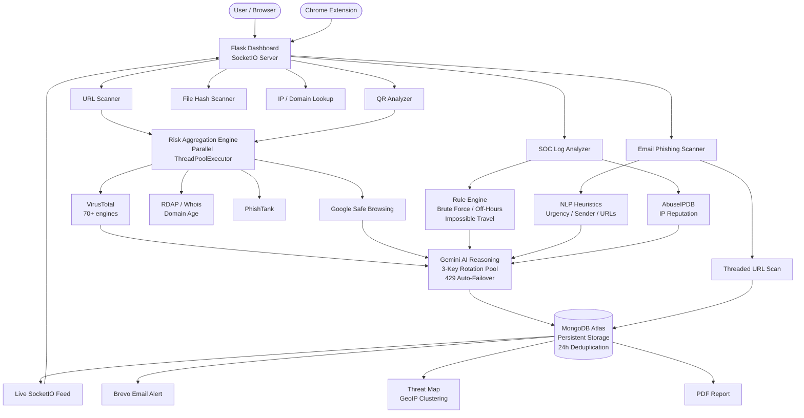

# AI-Powered Security Operations & Threat Intelligence Platform

A production-grade, self-hosted Security Operations Center (SOC) platform that orchestrates multiple threat intelligence pipelines in parallel, correlates signals using a multi-source risk aggregation engine, and surfaces actionable verdicts via a real-time SocketIO dashboard. Integrates Google Gemini as an AI reasoning layer on top of commercial threat feeds.

---

## Architecture Overview



---

## Feature Matrix

| Module | Detection Pipeline | Storage | Real-time |
|---|---|---|---|
| URL Scanner | VT (70+ engines) + SafeBrowsing + RDAP age + Gemini reasoning | MongoDB `threat_logs` | SocketIO broadcast |
| QR Analyzer | OpenCV decode → full URL pipeline | MongoDB `threat_logs` | SocketIO broadcast |
| SOC Log Analyzer | Regex rule engine + AbuseIPDB IP reputation + Gemini ambiguity pass | MongoDB `soc_events` | SocketIO broadcast |
| Email Phishing Scanner | Sender domain trust scoring + URL reputation (threaded) + urgency NLP heuristics + Gemini verdict | MongoDB `email_scans` | SocketIO broadcast |
| IP/Domain Intelligence | RDAP, geolocation, ASN, abuse confidence | - | - |
| File Hash Scanner | SHA-256/MD5/SHA-1 multi-hash + VirusTotal lookup | - | - |
| Threat Map | GeoIP aggregation of attacker IPs across all scan types | - | Live clustering |
| Chrome Extension | Background page scanner hitting the live backend API | - | - |

---

## Tech Stack

| Layer | Technology | Why |
|---|---|---|
| Runtime | Python 3.11 + eventlet | eventlet monkey-patches stdlib for async I/O without a full ASGI rewrite |
| Web framework | Flask + Flask-SocketIO | Blueprint-per-feature architecture keeps each module independently testable |
| Async worker | Gunicorn + eventlet worker class | Single-worker event loop; avoids threading conflicts with pymongo |
| AI | Google Gemini (`gemini-2.0-flash-lite`, `gemini-2.5-flash`) | Different models per module based on context size and latency requirements |
| Key management | 3-key rotation pool with 429 auto-failover | Extends free-tier daily quota 3x without any paid plan |
| Database | MongoDB Atlas (cloud) | Survives ephemeral Render filesystem resets; indexed on timestamp + source_type |
| Deduplication | 24-hour window per (source_type, input_value) | Prevents dashboard inflation from repeated identical scans |
| QR decoding | OpenCV `cv2.QRCodeDetector` | Zero native system dependencies vs pyzbar (requires libiconv/zbar) |
| Email alerting | Brevo REST API | SMTP blocked on Render free tier (ports 465/587 firewalled) |
| Real-time feed | Socket.IO with eventlet async | Sub-100ms push to all connected clients on each detection |
| Frontend | Vanilla HTML/CSS/JS + Socket.IO client | No build step; template served directly by Flask |
| Uptime | UptimeRobot 5-min ping | Prevents Render free-tier 15-minute sleep |

---

## Project Structure

```
.
├── backend/
│   ├── app.py                        # Flask app factory, blueprint registration, SocketIO init
│   ├── config.py                     # Env loader, Gemini key rotation state, is_configured() guard
│   ├── realtime.py                   # SocketIO broadcast helper + severity score map
│   ├── requirements.txt
│   ├── runtime.txt                   # Pins Python 3.11.9 for Render (prevents 3.14 auto-select)
│   ├── models/
│   │   └── database.py               # MongoDB client (lazy init), insert/read helpers, 24h dedup
│   ├── routes/                       # One Flask Blueprint per feature
│   │   ├── check_url.py              # /api/check-url, bulk scan, 24h cache layer
│   │   ├── scan_qr.py                # /api/scan-qr, OpenCV decode + URL pipeline
│   │   ├── soc_analyzer.py           # /api/analyze-logs, rule engine + AI pass
│   │   ├── email_scanner.py          # /email_scanner/api/scan + scan-eml, dedup by sender+subject
│   │   ├── geo.py                    # /api/geo-threats, GeoIP aggregation across collections
│   │   ├── settings.py               # /api/stats, /api/feed, /api/history, /api/export CSV
│   │   ├── ip_lookup.py              # /api/ip-lookup
│   │   ├── file_scan.py              # /api/file-scan
│   │   └── dashboard.py              # / → dashboard.html
│   ├── services/                     # One file per external integration (all gracefully degrade)
│   │   ├── risk_aggregator.py        # Parallel ThreadPoolExecutor fan-out + score fusion
│   │   ├── gemini_service.py         # Gemini reasoning with 3-key rotation + fallback
│   │   ├── virustotal_service.py
│   │   ├── safebrowsing_service.py
│   │   ├── abuseipdb_service.py
│   │   ├── rdap_service.py
│   │   ├── phishtank_service.py
│   │   ├── email_phishing_service.py # NLP heuristics + threaded URL scan + Gemini verdict
│   │   ├── log_analyzer.py           # Regex rule engine + AI-assisted ambiguous line detection
│   │   ├── alert_service.py          # Brevo REST alert with risk-band HTML email
│   │   ├── qr_service.py
│   │   ├── geo_service.py
│   │   ├── lookup_service.py
│   │   ├── report_service.py         # FPDF2 PDF report generation
│   │   └── mail_service.py
│   ├── templates/
│   │   └── dashboard.html            # Single-page app, SocketIO client, all feature UIs
│   └── sample_data/                  # Sample QR images and log files for demo
├── chrome-extension/
│   ├── manifest.json                 # MV3 extension manifest
│   ├── popup.html / popup.js         # Extension UI + backend API calls
│   └── background.js
├── .env.example                      # All configurable environment variables documented
└── render.yaml                       # Render deployment config
```

---

## Environment Variables

```env
# Gemini AI (3-key pool for quota rotation)
GEMINI_API_KEY=
GEMINI_API_KEY_2=
GEMINI_API_KEY_3=

# Threat Intelligence APIs
VIRUSTOTAL_API_KEY=
GOOGLE_SAFE_BROWSING_API_KEY=
ABUSEIPDB_API_KEY=
PHISHTANK_API_KEY=

# MongoDB Atlas
MONGO_URI=mongodb+srv://...

# Email Alerting (Brevo REST)
BREVO_API_KEY=
ALERT_EMAIL_FROM=
ALERT_EMAIL_TO=
ALERT_THRESHOLD=70

# App
SECRET_KEY=
DEBUG=false
```

All integrations degrade gracefully. The platform runs with zero keys using RDAP and heuristics only. Each key unlocks an additional detection layer.

---

## Local Setup

```bash
# Requires Python 3.11 exactly (eventlet 0.37.0 is incompatible with 3.12+)
python3.11 -m venv .venv
source .venv/bin/activate          # Windows: .venv\Scripts\activate

pip install -r backend/requirements.txt

cp .env.example .env               # Fill in keys
cd backend && python app.py
```

Open `http://localhost:5000`

---

## Deployment

Deployed on Render (Python 3.11.9, gunicorn + eventlet worker). MongoDB on Atlas free tier (M0). UptimeRobot pings every 5 minutes to prevent cold starts.

```
gunicorn -k eventlet -w 1 --timeout 120 --bind 0.0.0.0:$PORT app:app
```

Key deployment constraints solved:
- Render blocks SMTP (465/587) on free tier — solved by Brevo REST API
- Render filesystem is ephemeral — solved by MongoDB Atlas for all scan storage
- Gemini free tier quota exhaustion — solved by 3-key round-robin rotation with 429 auto-failover
- Python version mismatch (Render defaults to 3.14) — solved by `runtime.txt` in root directory

---

## Detection Logic

### URL Risk Score Fusion

Each source returns a 0-100 score. The aggregator runs all sources in parallel threads and fuses results:

```
final_score = weighted_average([vt, safebrowsing, phishtank, rdap_age_penalty])
            → passed to Gemini with evidence JSON for contextual reasoning
            → Gemini returns: risk_score, threat_label, reasoning, contributing_factors[]
```

### SOC Log Analysis (Two-pass)

**Pass 1 — Rule engine:**
- Brute force: 5+ failed logins from same IP
- Off-hours access: successful login between 00:00-05:59
- Known malicious IP: AbuseIPDB confidence score
- Impossible travel: same user, logins from 2+ countries

**Pass 2 — AI pass (capped at 8 lines):**
- Ambiguous lines matching keywords (sudo, privilege, escalat, exploit...) sent to Gemini
- Returns: line_index, severity, category, explanation per suspicious line

### Email Phishing Pipeline

```
1. Sender domain trust check (whitelist of 30+ known providers)
2. URL extraction → parallel VirusTotal/SafeBrowsing scan (max 5 URLs, threaded)
3. NLP urgency heuristics (12 regex patterns: account suspension, verify identity, etc.)
4. Reply-To domain mismatch detection
5. Risky attachment extension check (.exe, .js, .vbs, .iso, .lnk, .docm...)
6. Raw IP link detection
7. Gemini final verdict with full evidence bundle
```

---

## Chrome Extension

MV3 extension. Reads the current tab URL and sends it to the configured backend. Displays risk score, threat label, and sources inline in the popup. Caches results per URL.

Configure backend URL in extension settings (default: `http://localhost:5000`).
